

    

# Sittuccine Theme

Sittuccine Theme is a custom dark theme for Visual Studio Code, designed to provide a comfortable and visually appealing coding experience. The theme **made with love** for the **best developers** who needs the best code highlighting and readability.

## ⭐️ Star on GitHub

If you like this theme, please consider giving it a star on [GitHub](https://github.com/sitnikovik/sittuccine-vscode-theme)! Your support is greatly appreciated and helps me to keep improving the theme.

## Features

- **Carefully** selected colors for syntax highlighting for **each** code parts
- **Built-in function** highlighting **differs** to custom functions
- **Throw** blocks highlighted in **red** to attract attention
- **Docs** highlighted in **green**
- The colors selected manually for languages:
    - Golang
    - Python
    - PHP
    - Java
    - C#
    - C++
    - C
    - Javascript
    - Typescript
    - HTML
    - CSS, SCSS, SASS, LESS,
    - SQL

## Preview

### Python

**Dark**
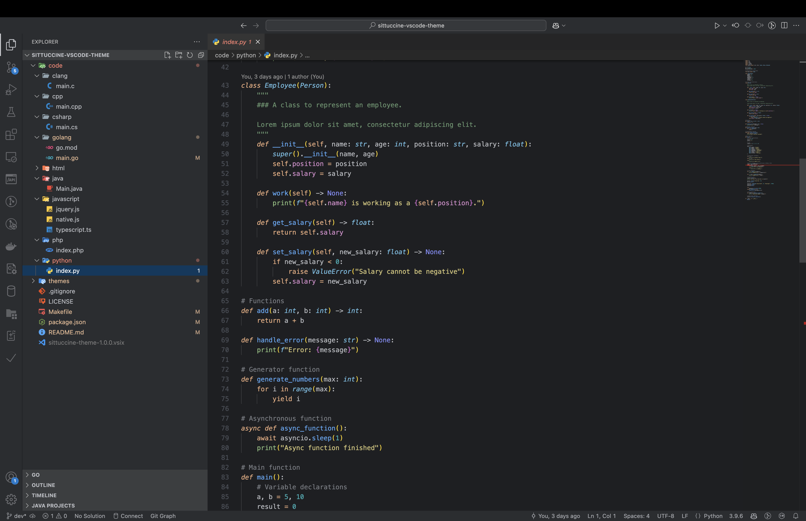

**Light**
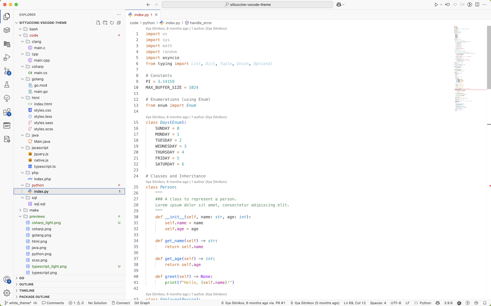

### Golang

**Dark**
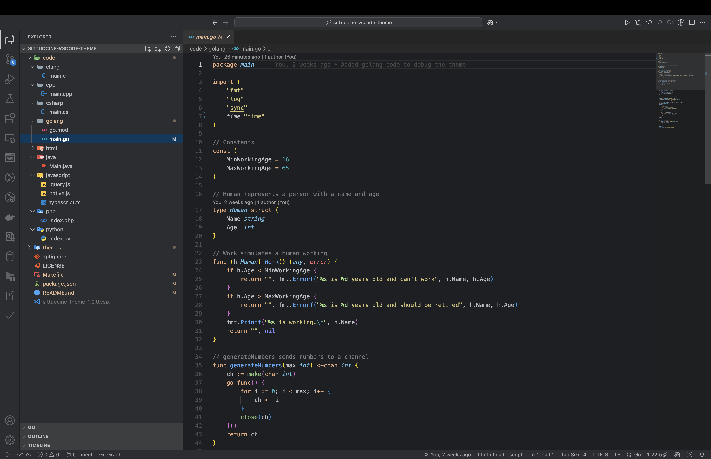

**Light**
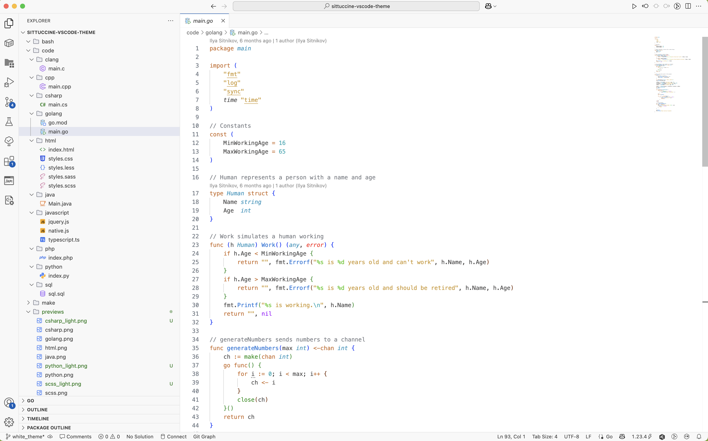

### Java

**Dark**
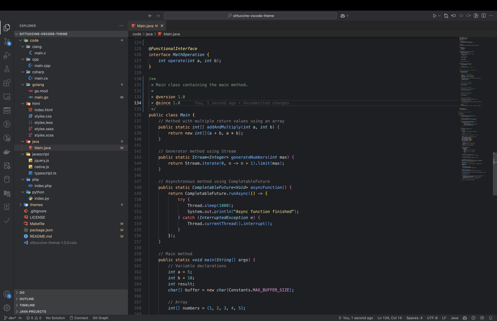

**Light**
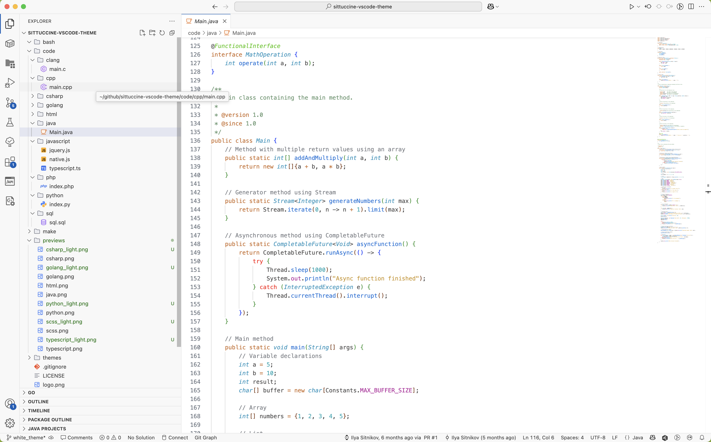

### C#

**Dark**
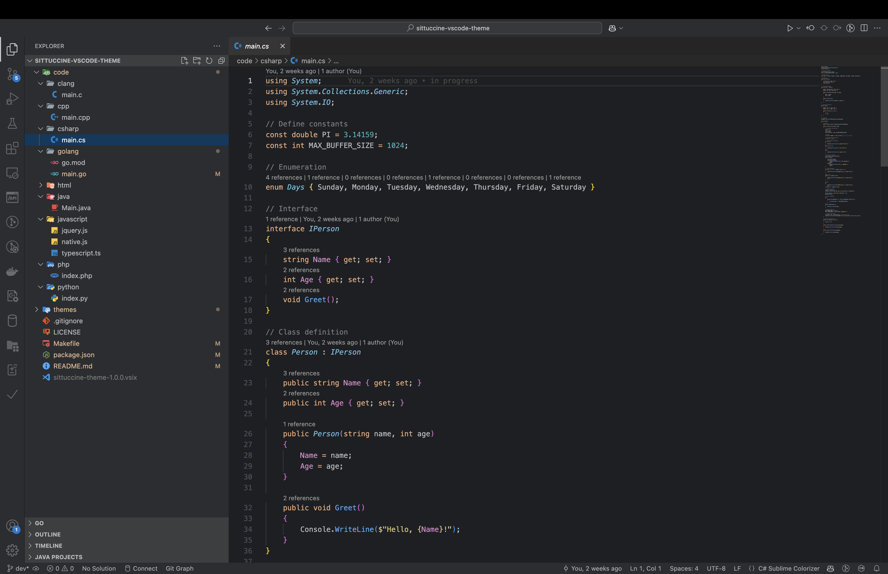

**Light**
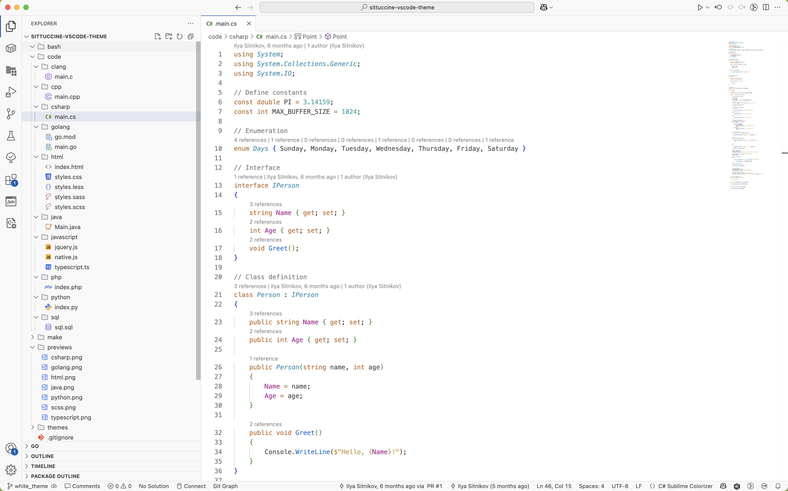

### SQL

**Dark**
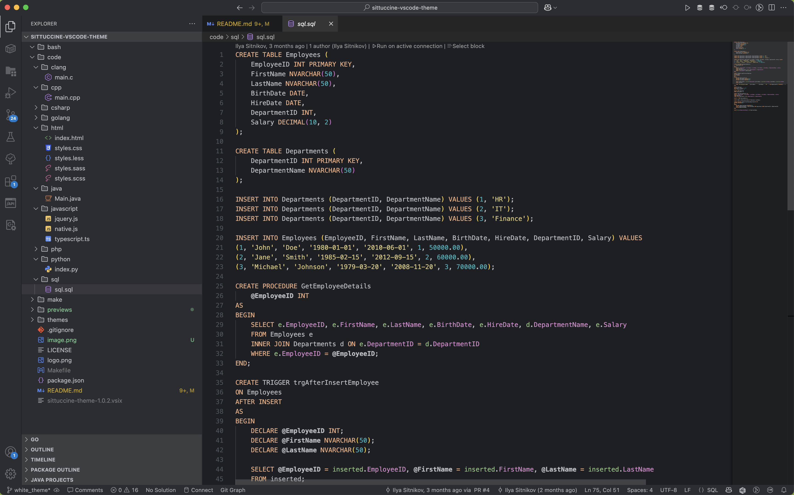

**Light**
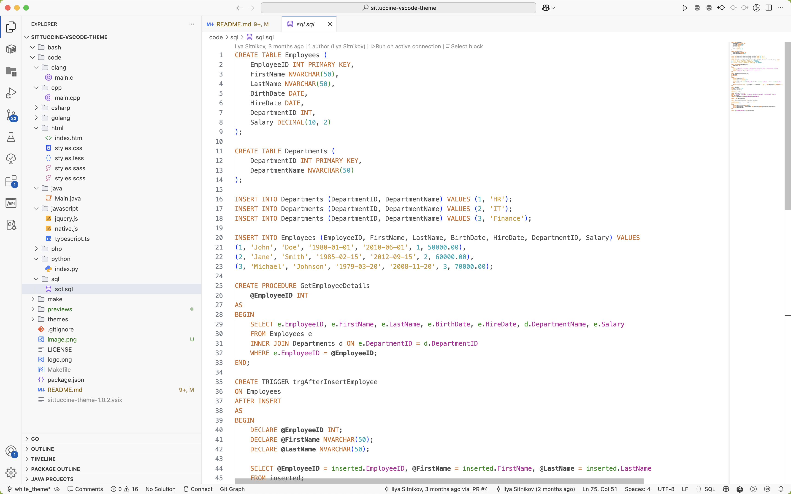

### Typescript

**Dark**
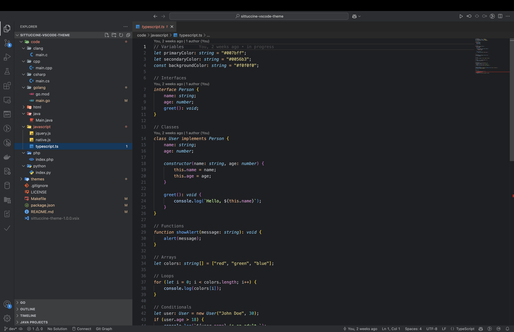

**Light**
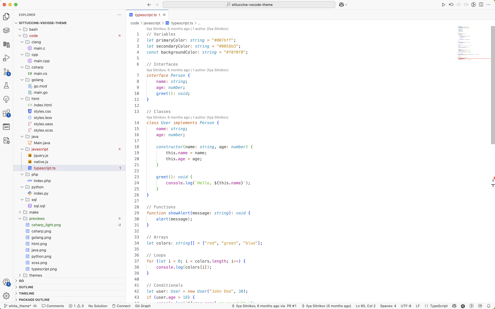

### HTML

**Dark**
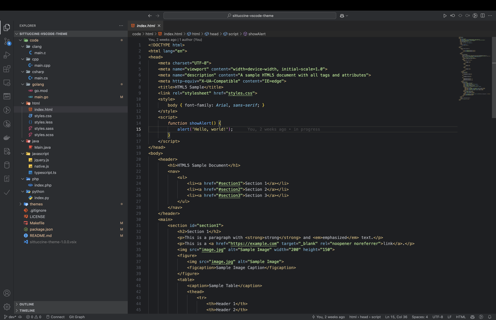

**Light**
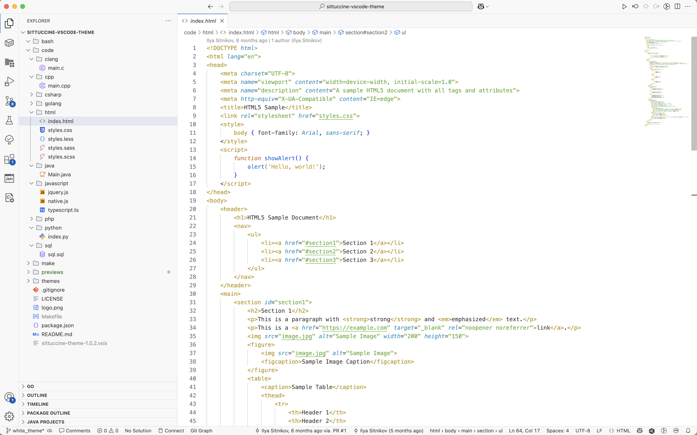

### SCSS

**Dark**
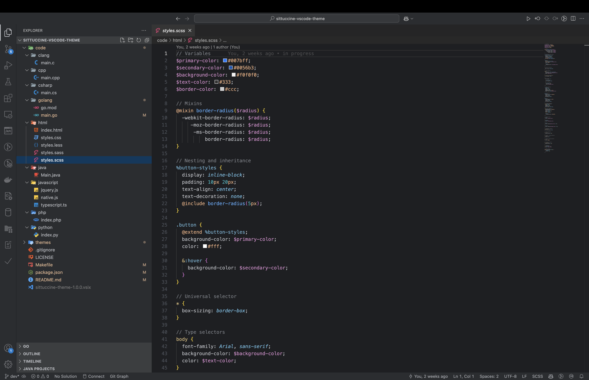

**Light**
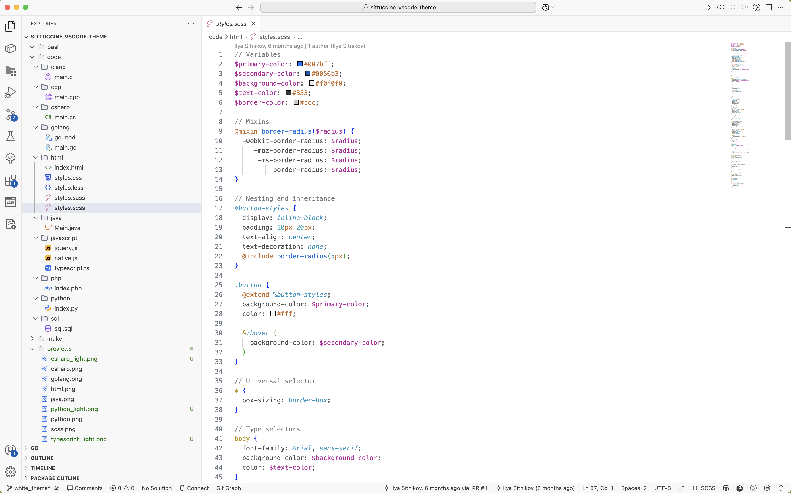

## Installation

### From Visual Studio Code Marketplace

1. Open Visual Studio Code.
2. Go to the Extensions view by clicking on the Extensions icon in the Activity Bar on the side of the window or by pressing `Ctrl+Shift+X`.
3. Search for "Sittuccine Theme".
4. Click "Install" to install the theme.
5. Go to `File > Preferences > Color Theme` and select "Sittuccine Theme" from the list.

### Manual Installation

1. Download the latest `.vsix` file from the [releases page](https://github.com/your-repo/sittuccine-theme/releases).
2. Open Visual Studio Code.
3. Go to the Extensions view by clicking on the Extensions icon in the Activity Bar on the side of the window or by pressing `Ctrl+Shift+X`.
4. Click on the three dots in the upper right corner and select "Install from VSIX...".
5. Select the downloaded `.vsix` file to install the theme.
6. Go to `File > Preferences > Color Theme` and select "Sittuccine Theme" from the list.
